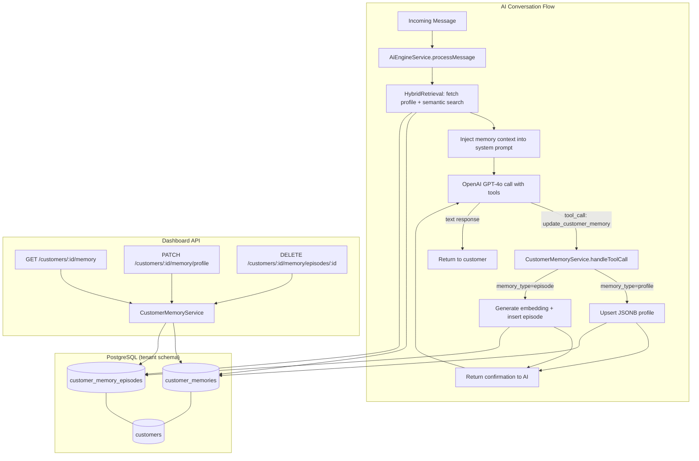

# Design Document: Customer Memory

## Overview

This design implements a hybrid long-term memory system for customers in VSPRO. The system combines two complementary storage strategies within each tenant's isolated PostgreSQL schema:

1. **Deterministic Profile (JSONB)** — Structured facts about a customer (preferences, sizes, addresses, purchase history summaries) stored as a single JSONB document per customer. Supports instant key-based lookups and deep-merge upserts.

2. **Episodic Conversational Memory (pgvector)** — Conversation snippets and learned context stored as 1536-dimensional vector embeddings. Supports semantic similarity search to surface relevant past interactions.

The AI assistant writes to both stores autonomously via an `update_customer_memory` OpenAI function-calling tool during conversations. A hybrid retrieval mechanism merges structured profile data with top-K semantically relevant episodes into the system prompt, giving the AI full customer context.

### Key Design Decisions

| Decision | Rationale |
|----------|-----------|
| Separate tables for profile vs episodes | Profile is 1:1 per customer (upsert semantics), episodes are 1:N (append-only with vector index). Different access patterns warrant separate tables. |
| HNSW index over IVFFlat | HNSW provides better recall at low latency without requiring periodic retraining. Suitable for the expected episode volume (hundreds per customer, not millions). |
| text-embedding-3-small (1536d) | Already used in the existing `ai_memories` table and `products.embedding`. Consistent dimensionality across the system. |
| Tool registered as OpenAI function call | Matches the existing pattern in `AiEngineService.getTools()` and `AiToolsExtenderService`. No new infrastructure needed. |
| Schema-per-tenant isolation | Continues the existing pattern — all new tables live inside `"{{schema}}"` ensuring zero cross-tenant data leakage at the PostgreSQL level. |

## Architecture



## Components and Interfaces

### 1. CustomerMemoryService (new)

Replaces and extends the existing `AiMemoryService`. Responsible for all memory CRUD operations.

```typescript
@Injectable()
export class CustomerMemoryService {
  // ─── Profile Operations ───────────────────────────────────
  
  /** Upsert structured data into customer profile JSONB */
  async upsertProfile(
    customerId: string,
    category: string,
    data: Record<string, any>,
    schemaName: string,
  ): Promise<void>;

  /** Get full profile for a customer */
  async getProfile(customerId: string, schemaName: string): Promise<CustomerProfile | null>;

  // ─── Episode Operations ───────────────────────────────────

  /** Store an episodic memory with embedding */
  async createEpisode(
    customerId: string,
    content: string,
    category: EpisodeCategory,
    schemaName: string,
  ): Promise<{ id: string }>;

  /** Semantic search over customer episodes */
  async searchEpisodes(
    customerId: string,
    queryEmbedding: number[],
    schemaName: string,
    limit?: number,
  ): Promise<EpisodeResult[]>;

  /** Get recent episodes (non-semantic, for dashboard) */
  async getRecentEpisodes(
    customerId: string,
    schemaName: string,
    limit?: number,
  ): Promise<EpisodeResult[]>;

  /** Delete a specific episode */
  async deleteEpisode(episodeId: string, customerId: string, schemaName: string): Promise<void>;

  /** Delete all memory for a customer */
  async deleteAllMemory(customerId: string, schemaName: string): Promise<void>;

  // ─── Hybrid Retrieval ─────────────────────────────────────

  /** Build formatted context string for AI prompt injection */
  async buildMemoryContext(
    customerId: string,
    currentMessage: string,
    schemaName: string,
  ): Promise<string>;

  // ─── Embedding ────────────────────────────────────────────

  /** Generate embedding via text-embedding-3-small */
  async generateEmbedding(text: string): Promise<number[] | null>;

  // ─── Tool Handler ─────────────────────────────────────────

  /** Handle the update_customer_memory tool call from AI */
  async handleToolCall(
    customerId: string,
    args: UpdateCustomerMemoryArgs,
    schemaName: string,
  ): Promise<string>;

  // ─── Migration ────────────────────────────────────────────

  /** Migrate data from legacy ai_memories table */
  async migrateFromLegacy(schemaName: string): Promise<MigrationResult>;
}
```

### 2. CustomerMemoryController (new)

REST endpoints for dashboard memory management.

```typescript
@Controller('customers/:customerId/memory')
export class CustomerMemoryController {
  @Get()
  async getMemory(@Param('customerId') id: string, @Tenant() schema: string);

  @Patch('profile')
  async updateProfile(@Param('customerId') id: string, @Body() dto: UpdateProfileDto, @Tenant() schema: string);

  @Delete('episodes/:episodeId')
  async deleteEpisode(@Param('customerId') id: string, @Param('episodeId') episodeId: string, @Tenant() schema: string);

  @Delete()
  async deleteAllMemory(@Param('customerId') id: string, @Tenant() schema: string);
}
```

### 3. AiEngineService (modified)

Changes to the existing service:
- Add `update_customer_memory` to the tools array in `getTools()`
- Handle the tool call in `executeTool()` by delegating to `CustomerMemoryService.handleToolCall()`
- Replace `AiMemoryService.buildMemoryContext()` call with `CustomerMemoryService.buildMemoryContext()`

### 4. Database Migration Script

SQL migration to create new tables and migrate data from `ai_memories`.

## Data Models

### customer_memories table

```sql
CREATE TABLE IF NOT EXISTS "{{schema}}".customer_memories (
  id          UUID PRIMARY KEY DEFAULT gen_random_uuid(),
  customer_id UUID NOT NULL REFERENCES "{{schema}}".customers(id) ON DELETE CASCADE,
  profile     JSONB NOT NULL DEFAULT '{}',
  created_at  TIMESTAMPTZ NOT NULL DEFAULT NOW(),
  updated_at  TIMESTAMPTZ NOT NULL DEFAULT NOW(),
  UNIQUE(customer_id)
);
```

### customer_memory_episodes table

```sql
CREATE TABLE IF NOT EXISTS "{{schema}}".customer_memory_episodes (
  id          UUID PRIMARY KEY DEFAULT gen_random_uuid(),
  customer_id UUID NOT NULL REFERENCES "{{schema}}".customers(id) ON DELETE CASCADE,
  content     TEXT NOT NULL,
  embedding   vector(1536),
  category    VARCHAR(50) NOT NULL DEFAULT 'general_context',
  created_at  TIMESTAMPTZ NOT NULL DEFAULT NOW()
);

-- HNSW index for approximate nearest-neighbor search
CREATE INDEX IF NOT EXISTS idx_customer_memory_episodes_embedding
  ON "{{schema}}".customer_memory_episodes
  USING hnsw (embedding vector_cosine_ops)
  WITH (m = 16, ef_construction = 64);

-- Filter index for customer-scoped queries
CREATE INDEX IF NOT EXISTS idx_customer_memory_episodes_customer
  ON "{{schema}}".customer_memory_episodes(customer_id);
```

### Profile JSONB Structure

```typescript
interface CustomerProfile {
  preferences?: Record<string, any>;      // e.g., { "color": "azul", "estilo": "casual" }
  sizes?: Record<string, string>;          // e.g., { "camisa": "M", "zapatos": "42" }
  addresses?: Array<{
    label: string;
    street: string;
    city: string;
    zip?: string;
  }>;
  purchase_history_summary?: {
    total_orders: number;
    favorite_products: string[];
    average_order_value: number;
    last_order_date: string;
  };
  important_dates?: Record<string, string>; // e.g., { "cumpleaños": "1990-03-15" }
  custom_facts?: Record<string, any>;       // freeform key-value
}
```

### Episode Categories (enum)

```typescript
type EpisodeCategory =
  | 'conversation_summary'
  | 'preference_detected'
  | 'complaint'
  | 'product_interest'
  | 'general_context';
```

### update_customer_memory Tool Schema

```typescript
const updateCustomerMemoryTool: OpenAI.Chat.ChatCompletionTool = {
  type: 'function',
  function: {
    name: 'update_customer_memory',
    description: 'Guarda información aprendida sobre el cliente para futuras conversaciones. Usa "profile" para datos estructurados (preferencias, tallas, direcciones) y "episode" para contexto conversacional.',
    parameters: {
      type: 'object',
      properties: {
        memory_type: {
          type: 'string',
          enum: ['profile', 'episode'],
          description: 'Tipo de memoria: "profile" para datos estructurados, "episode" para contexto conversacional',
        },
        category: {
          type: 'string',
          description: 'Categoría: para profile usa "preferences"|"sizes"|"addresses"|"purchase_history_summary"|"important_dates"|"custom_facts". Para episode usa "conversation_summary"|"preference_detected"|"complaint"|"product_interest"|"general_context".',
        },
        content: {
          type: 'string',
          description: 'Texto descriptivo del recuerdo (requerido para episodes, opcional para profile)',
        },
        data: {
          type: 'object',
          description: 'Datos estructurados para profile updates (ej: {"color": "azul", "talla": "M"})',
        },
      },
      required: ['memory_type', 'category'],
    },
  },
};
```

### JSONB Merge Strategy

Profile upserts use PostgreSQL's `jsonb_deep_merge` pattern:

```sql
INSERT INTO "{{schema}}".customer_memories (customer_id, profile)
VALUES ($1::uuid, jsonb_build_object($2::text, $3::jsonb))
ON CONFLICT (customer_id)
DO UPDATE SET
  profile = customer_memories.profile || jsonb_build_object($2::text, $3::jsonb),
  updated_at = NOW();
```

For nested merges (e.g., adding a key to `preferences` without overwriting others):

```sql
UPDATE "{{schema}}".customer_memories
SET profile = jsonb_set(
  profile,
  ARRAY[$2::text],
  COALESCE(profile->$2::text, '{}'::jsonb) || $3::jsonb
),
updated_at = NOW()
WHERE customer_id = $1::uuid;
```


## Correctness Properties

*A property is a characteristic or behavior that should hold true across all valid executions of a system — essentially, a formal statement about what the system should do. Properties serve as the bridge between human-readable specifications and machine-verifiable correctness guarantees.*

### Property 1: Profile upsert merge invariant

*For any* existing customer profile with arbitrary keys populated, and *for any* valid partial update targeting a single category key, after the upsert completes, all keys not targeted by the update SHALL remain unchanged, AND the targeted key SHALL contain the new data merged with any pre-existing values under that key.

**Validates: Requirements 2.1, 2.3**

### Property 2: Profile key validation

*For any* string that is NOT one of the allowed profile keys (`preferences`, `sizes`, `addresses`, `purchase_history_summary`, `important_dates`, `custom_facts`), attempting to upsert data under that key SHALL be rejected, AND the profile SHALL remain unchanged.

**Validates: Requirements 2.2**

### Property 3: Episode storage round-trip

*For any* valid episode content string and *for any* valid category, after storing the episode, retrieving it by ID SHALL return the same content text, the same category, and (if an embedding was provided) the same embedding vector.

**Validates: Requirements 3.2**

### Property 4: Episode category validation

*For any* string that is NOT one of the allowed episode categories (`conversation_summary`, `preference_detected`, `complaint`, `product_interest`, `general_context`), attempting to create an episode with that category SHALL be rejected, AND no new row SHALL be inserted.

**Validates: Requirements 3.3**

### Property 5: Semantic search ordering and limit

*For any* set of N episodes (N ≥ 5) belonging to a customer, each with a known embedding vector, and *for any* query vector, the semantic search SHALL return at most 5 results, AND those results SHALL be ordered by descending cosine similarity to the query vector.

**Validates: Requirements 5.2**

### Property 6: Hybrid context completeness

*For any* customer with a non-empty profile and at least one episodic memory, the formatted context string produced by `buildMemoryContext` SHALL contain a representation of the profile data AND SHALL contain the content text of at least one relevant episode.

**Validates: Requirements 5.1, 5.3**

### Property 7: Tenant isolation for memory operations

*For any* customer_id that does not exist in a given tenant schema, all memory read and write operations (getProfile, createEpisode, upsertProfile, deleteAllMemory) executed against that schema SHALL fail with a not-found or forbidden error, AND no data SHALL be written.

**Validates: Requirements 7.6**

### Property 8: Migration preserves data and maps categories

*For any* set of legacy `ai_memories` records with type `conversation_summary` or `preference`, after migration, each record SHALL appear in `customer_memory_episodes` with the correct mapped category (`conversation_summary` → `conversation_summary`, `preference` → `preference_detected`), AND any non-null embedding SHALL be preserved identically.

**Validates: Requirements 8.1, 8.2, 8.3**

### Property 9: Unique profile per customer

*For any* customer_id, regardless of how many upsert operations are performed, the `customer_memories` table SHALL contain at most one row for that customer_id.

**Validates: Requirements 1.3**

## Error Handling

| Scenario | Behavior | Recovery |
|----------|----------|----------|
| OpenAI embedding API unavailable | Store episode with NULL embedding, log warning | Background job retries embedding generation for NULL entries |
| OpenAI embedding API rate-limited | Exponential backoff (3 retries, 1s/2s/4s) | Falls back to NULL embedding after retries exhausted |
| customer_id not in conversation context | Return error JSON to AI: `{"error": "customer_not_identified"}` | AI informs user it cannot save memory without identification |
| Invalid profile category key | Reject with validation error, return error to AI | AI receives error and can retry with valid key |
| Invalid episode category | Reject with validation error | Same as above |
| Database connection failure | Throw, caught by AiEngineService error handler | AI responds with generic error message; memory operation is lost |
| JSONB merge conflict (concurrent writes) | PostgreSQL row-level lock on upsert ensures serialization | No data loss — second write merges on top of first |
| Embedding dimension mismatch | Reject at insert (PostgreSQL vector type enforces 1536) | Log error, store with NULL embedding |
| Migration: legacy record missing customer_id FK | Skip record, log warning with record ID | Manual review of skipped records |

### Graceful Degradation

The memory system is designed to degrade gracefully:
1. **No embeddings available** → Episodic search falls back to most-recent ordering
2. **No profile exists** → Hybrid retrieval returns only episodic results (or empty)
3. **No episodes exist** → Hybrid retrieval returns only profile (or empty)
4. **Entire memory system down** → AI continues without memory context (existing behavior)

## Testing Strategy

### Property-Based Tests (fast-check)

The project uses Jest as its test runner. Property-based tests will use **fast-check** for TypeScript.

Each property test runs a minimum of **100 iterations** with randomized inputs.

**Configuration:**
```typescript
import fc from 'fast-check';

// Each test tagged with feature + property reference
// Tag format: Feature: customer-memory, Property N: <description>
```

**Properties to implement:**
1. Profile merge invariant (Property 1) — Generate random initial profiles and partial updates
2. Profile key validation (Property 2) — Generate arbitrary strings, test against allowlist
3. Episode storage round-trip (Property 3) — Generate random content + categories
4. Episode category validation (Property 4) — Generate arbitrary strings
5. Semantic search ordering (Property 5) — Generate random embedding vectors, verify sort order
6. Hybrid context completeness (Property 6) — Generate random profiles + episodes
7. Tenant isolation (Property 7) — Generate random UUIDs not in schema
8. Migration mapping (Property 8) — Generate random legacy records
9. Unique profile constraint (Property 9) — Generate random upsert sequences

### Unit Tests (Jest)

Focus on specific examples and edge cases:
- Tool handler returns confirmation message (4.4)
- Tool handler returns error when customer_id missing (4.5)
- Empty memory returns empty context string (5.4)
- Embedding API failure stores NULL embedding (3.4)
- API endpoints require authentication (7.5)
- Migration logs per-customer counts (8.4)
- Tool is registered in getTools() array (6.1)
- System prompt contains memory context in correct position (6.4)

### Integration Tests

- Full retrieval latency < 200ms with 100 episodes (5.5)
- Profile retrieval < 50ms for cached reads (2.4)
- AiEngineService executes tool call via CustomerMemoryService (6.2)
- Conversation resolution triggers summary generation (6.3)
- Schema provisioning creates both tables with correct structure (1.1, 1.2, 1.4, 1.5)
- End-to-end: message → memory write → next message retrieves context

### Tenant Isolation Tests (Critical)

Dedicated test suite ensuring cross-tenant data leakage is impossible:
- Create memory in tenant A, query from tenant B → returns nothing
- Vector search in tenant A never returns tenant B episodes
- Profile upsert in tenant A never affects tenant B profiles
- Migration only processes records within the target schema
