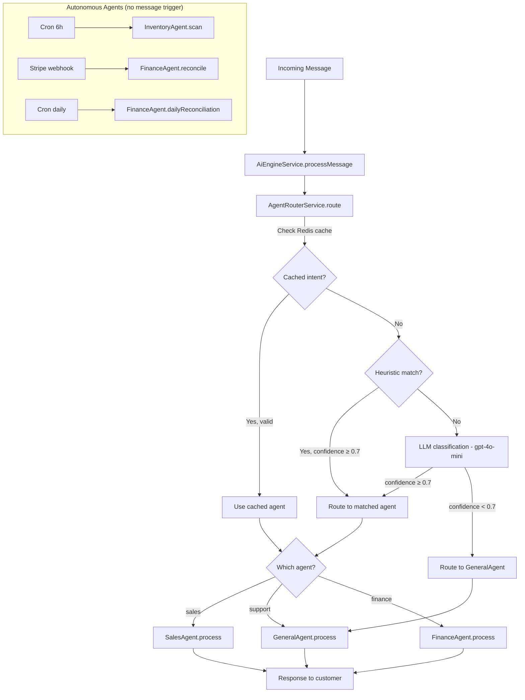

# Design Document: Multi-Agent Router

## Overview

This design refactors the monolithic `AiEngineService` into a multi-agent architecture with specialized agents routed by intent classification. Each agent has its own optimized system prompt, tool set, and processing logic, reducing token usage and improving response quality.

### Key Design Decisions

| Decision | Rationale |
|----------|-----------|
| Heuristic-first routing | Keywords + order state cover 80% of cases without LLM cost |
| gpt-4o-mini for classification fallback | Fast (~50ms) and cheap for the 20% ambiguous cases |
| Redis intent cache per conversation | Avoids re-classification on follow-up messages (TTL 30min) |
| Agents as classes within AiModule | Simpler DI than separate NestJS modules; shared services |
| GeneralAgent wraps current behavior | Zero breaking changes; existing tenants work identically |
| InventoryAgent is cron-only | No message processing; autonomous background scanning |
| FinanceAgent is event+cron | Stripe webhooks trigger matching; daily cron catches stragglers |

## Architecture



## Components and Interfaces

### 1. BaseAgent (abstract)

```typescript
export interface AgentContext {
  conversationId: string;
  customerId: string | null;
  conversationHistory: OpenAI.Chat.ChatCompletionMessageParam[];
  tenantConfig: any;
  agentConfig: AgentSettings;
  schemaName: string;
  memoryContext: string;
}

export interface AgentResponse {
  text: string;
  toolsExecuted?: string[];
  updatedContext?: Record<string, any>;
}

export abstract class BaseAgent {
  abstract readonly name: string;
  abstract readonly description: string;

  constructor(
    protected readonly prisma: PrismaService,
    protected readonly config: ConfigService,
    protected readonly customerMemory: CustomerMemoryService,
  ) {}

  abstract getSystemPrompt(tenant: any, agentConfig: AgentSettings): string;
  abstract getTools(): OpenAI.Chat.ChatCompletionTool[];
  abstract executeTool(name: string, args: any, context: AgentContext): Promise<string>;

  async process(
    message: string,
    context: AgentContext,
    tenant: any,
  ): Promise<AgentResponse> {
    // 1. Build system prompt
    // 2. Assemble messages (system + history + memory + current)
    // 3. Call OpenAI with agent-specific tools
    // 4. Handle tool calls if any
    // 5. Return response
  }
}
```

### 2. AgentRouterService

```typescript
export type AgentType = 'sales' | 'inventory' | 'finance' | 'support' | 'general';

export interface RouteResult {
  agent: AgentType;
  confidence: number;
  source: 'cache' | 'heuristic' | 'llm';
}

@Injectable()
export class AgentRouterService {
  constructor(
    private readonly redis: Redis,
    private readonly config: ConfigService,
    private readonly openai: OpenAI,
  ) {}

  async route(
    message: string,
    conversationContext: any,
    schemaName: string,
    agentConfig: AgentConfig,
  ): Promise<RouteResult> {
    const conversationId = conversationContext.id;

    // 1. Check Redis cache
    const cached = await this.getCachedIntent(conversationId);
    if (cached) return { ...cached, source: 'cache' };

    // 2. Try heuristic classification
    const heuristic = this.classifyHeuristic(message, conversationContext);
    if (heuristic.confidence >= 0.7) {
      await this.cacheIntent(conversationId, heuristic);
      return { ...heuristic, source: 'heuristic' };
    }

    // 3. LLM fallback
    const llmResult = await this.classifyLLM(message, conversationContext);
    if (llmResult.confidence >= 0.7) {
      await this.cacheIntent(conversationId, llmResult);
      return { ...llmResult, source: 'llm' };
    }

    // 4. Default to general
    return { agent: 'general', confidence: llmResult.confidence, source: 'llm' };
  }

  private classifyHeuristic(message: string, context: any): { agent: AgentType; confidence: number } {
    const lower = message.toLowerCase();
    const orderState = context?.orderState;

    // Sales signals
    if (/precio|caro|descuento|promoción|comprar|pedir|ordenar|cuánto cuesta/i.test(lower)) {
      return { agent: 'sales', confidence: 0.85 };
    }
    if (orderState === 'payment_pending' || orderState === 'new') {
      return { agent: 'sales', confidence: 0.8 };
    }

    // Finance signals
    if (/pago|transferencia|comprobante|factura|cobro/i.test(lower)) {
      return { agent: 'finance', confidence: 0.8 };
    }

    // Support signals
    if (/problema|error|queja|devolver|cambio|ayuda/i.test(lower)) {
      return { agent: 'support', confidence: 0.75 };
    }

    // Inconclusive
    return { agent: 'general', confidence: 0.4 };
  }

  private async classifyLLM(message: string, context: any): Promise<{ agent: AgentType; confidence: number }> {
    const response = await this.openai.chat.completions.create({
      model: 'gpt-4o-mini',
      messages: [
        {
          role: 'system',
          content: `Clasifica la intención del siguiente mensaje de cliente en una de estas categorías:
- sales: quiere comprar, preguntar precio, pedir descuento, hacer pedido
- finance: preguntar por pago, enviar comprobante, facturación
- support: problema, queja, devolución, cambio, ayuda técnica
- general: saludo, pregunta general, no clasificable

Responde SOLO con JSON: {"intent": "categoria", "confidence": 0.0-1.0}`,
        },
        { role: 'user', content: message },
      ],
      temperature: 0,
      max_tokens: 50,
    });

    try {
      const parsed = JSON.parse(response.choices[0].message.content ?? '{}');
      return { agent: parsed.intent ?? 'general', confidence: parsed.confidence ?? 0.5 };
    } catch {
      return { agent: 'general', confidence: 0.3 };
    }
  }

  // Redis cache methods
  private async getCachedIntent(conversationId: string): Promise<RouteResult | null> { /* ... */ }
  private async cacheIntent(conversationId: string, result: { agent: AgentType; confidence: number }): Promise<void> { /* ... */ }
  async invalidateCache(conversationId: string): Promise<void> { /* ... */ }
}
```

### 3. SalesAgent

```typescript
@Injectable()
export class SalesAgent extends BaseAgent {
  readonly name = 'sales';
  readonly description = 'Agente de ventas y conversión';

  getSystemPrompt(tenant: any, agentConfig: AgentSettings): string {
    const policies = agentConfig.commercial_policies;
    return `Eres el agente de ventas de ${tenant.businessName}.
Tu objetivo es cerrar la venta de forma amigable pero efectiva.

POLÍTICAS COMERCIALES:
- Descuento máximo: ${policies?.max_discount_percent ?? 0}%
- Descuento primera compra: ${policies?.first_purchase_discount ?? 0}%
- Promociones activas: ${JSON.stringify(policies?.active_promotions ?? [])}

INSTRUCCIONES:
- Maneja objeciones de precio con beneficios del producto
- Ofrece descuentos SOLO dentro de los límites de la política
- Si el cliente duda, programa un follow-up
- Sugiere productos complementarios (upsell)
- Sé conciso — mensajes de WhatsApp cortos`;
  }

  getTools(): OpenAI.Chat.ChatCompletionTool[] {
    return [
      /* create_order, apply_discount, check_product_availability, suggest_upsell, schedule_follow_up */
    ];
  }

  async executeTool(name: string, args: any, context: AgentContext): Promise<string> {
    // Handles: create_order, apply_discount, check_product_availability, suggest_upsell, schedule_follow_up
  }
}
```

### 4. InventoryAgent

```typescript
@Injectable()
export class InventoryAgent extends BaseAgent {
  readonly name = 'inventory';
  readonly description = 'Agente autónomo de monitoreo de inventario';

  /** Cron-triggered: scans all tenant schemas for low stock */
  async scanAllTenants(): Promise<void> {
    // 1. Get all active tenants
    // 2. For each tenant, scan stock levels
    // 3. Generate supplier email drafts for flagged items
    // 4. Enqueue drafts for admin review
  }

  async scanTenantStock(schemaName: string): Promise<LowStockItem[]> {
    return this.prisma.$queryRawUnsafe(`
      SELECT p.id, p.name, p.sku, p.supplier_info,
             i.stock_available, i.stock_minimum
      FROM "${schemaName}".products p
      JOIN "${schemaName}".inventory i ON i.product_id = p.id
      WHERE i.stock_available < i.stock_minimum AND p.is_active = true
    `);
  }

  generateSupplierDraft(items: LowStockItem[], tenantName: string): string {
    // Generate email body with reorder details
  }
}
```

### 5. FinanceAgent

```typescript
@Injectable()
export class FinanceAgent extends BaseAgent {
  readonly name = 'finance';
  readonly description = 'Agente de conciliación financiera';

  /** Event-triggered: matches Stripe webhook against payments */
  async reconcileStripeEvent(
    event: { amount: number; reference: string; stripeId: string },
    schemaName: string,
    tolerance: number,
  ): Promise<ReconciliationResult> {
    // 1. Find payment by order reference
    // 2. Calculate discrepancy
    // 3. If within tolerance → auto-reconcile
    // 4. If exceeds tolerance → escalate
  }

  /** Cron-triggered: daily pass for unmatched payments */
  async dailyReconciliation(schemaName: string): Promise<void> {
    // Find payments older than 24h without reconciliation
  }
}
```

### 6. GeneralAgent (backward compat)

```typescript
@Injectable()
export class GeneralAgent extends BaseAgent {
  readonly name = 'general';
  readonly description = 'Agente general (fallback — comportamiento actual)';

  // Wraps the current AiEngineService.getTools() and buildSystemPrompt()
  // Ensures zero breaking changes for existing tenants
}
```

## Data Models

### New fields in tenant schema

```sql
-- Products: supplier information for InventoryAgent
ALTER TABLE "{{schema}}".products
  ADD COLUMN IF NOT EXISTS supplier_info JSONB DEFAULT '{}';

-- AI Config: multi-agent configuration
ALTER TABLE "{{schema}}".ai_config
  ADD COLUMN IF NOT EXISTS agent_config JSONB DEFAULT '{
    "router_model": "gpt-4o-mini",
    "agents": {
      "sales": {"enabled": true, "model": "gpt-4o", "temperature": 0.4},
      "inventory": {"enabled": true, "model": "gpt-4o-mini", "cron": "0 */6 * * *"},
      "finance": {"enabled": false, "model": "gpt-4o-mini"},
      "support": {"enabled": true, "model": "gpt-4o", "temperature": 0.2},
      "general": {"enabled": true, "model": "gpt-4o", "temperature": 0.3}
    },
    "commercial_policies": {
      "max_discount_percent": 15,
      "first_purchase_discount": 10,
      "active_promotions": []
    }
  }';
```

### TypeScript interfaces

```typescript
interface AgentConfig {
  router_model: string;
  agents: Record<AgentType, AgentSettings>;
  commercial_policies: CommercialPolicies;
}

interface AgentSettings {
  enabled: boolean;
  model: string;
  temperature?: number;
  cron?: string;
}

interface CommercialPolicies {
  max_discount_percent: number;
  first_purchase_discount: number;
  active_promotions: Array<{
    name: string;
    discount_percent: number;
    valid_until: string;
    conditions?: string;
  }>;
}

interface SupplierInfo {
  supplier_name?: string;
  supplier_email?: string;
  supplier_phone?: string;
  lead_time_days?: number;
  minimum_order_quantity?: number;
}

interface ReconciliationResult {
  status: 'auto_reconciled' | 'escalated' | 'no_match';
  discrepancy?: number;
  note?: string;
}
```

## Correctness Properties

### Property 1: Router confidence threshold enforcement
*For any* message and *for any* classification result with confidence < 0.7, the system SHALL route to GeneralAgent regardless of the classified intent.
**Validates: Requirements 2.4, 8.2**

### Property 2: Intent cache consistency
*For any* conversation with a cached intent, if the conversation state changes (new order state or explicit topic change), the cache SHALL be invalidated before the next routing decision.
**Validates: Requirements 2.5, 2.6**

### Property 3: Discount policy enforcement
*For any* discount applied by the SalesAgent, the discount percentage SHALL NOT exceed the max_discount_percent defined in the tenant's CommercialPolicies.
**Validates: Requirements 3.3, 3.4**

### Property 4: Reconciliation tolerance boundary
*For any* payment discrepancy, if the absolute value exceeds the configured Reconciliation_Tolerance, the FinanceAgent SHALL escalate (never auto-reconcile).
**Validates: Requirements 5.2, 5.3**

### Property 5: Backward compatibility invariant
*For any* tenant without agent_config defined, the system SHALL produce identical responses to the current monolithic AiEngineService for the same input.
**Validates: Requirements 8.1, 8.3, 8.4**

### Property 6: Agent isolation
*For any* agent instance, the tools available to that agent SHALL be exclusively those defined in its getTools() method — no agent can invoke another agent's tools.
**Validates: Requirements 1.1, 3.2**

## Error Handling

| Scenario | Behavior | Recovery |
|----------|----------|----------|
| Redis unavailable for cache | Skip cache, classify every message | Graceful degradation, slightly higher latency |
| LLM classification fails | Default to GeneralAgent | Log error, no user impact |
| SalesAgent discount exceeds policy | Reject tool call, return error to AI | AI reformulates with valid discount |
| InventoryAgent scan fails for one tenant | Skip tenant, continue others | Log error, retry next cycle |
| FinanceAgent Stripe event has no match | Create alert for admin | Manual review queue |
| Agent process() throws | Catch in router, fallback to GeneralAgent | User gets generic response |
| Invalid agent_config JSON | Use default config | Log warning on tenant load |

## Testing Strategy

### Unit Tests
- Router heuristic classification (keyword matching)
- Router confidence threshold (< 0.7 → general)
- SalesAgent discount policy enforcement
- FinanceAgent tolerance boundary
- GeneralAgent backward compatibility (same output as current)
- Intent cache set/get/invalidate

### Integration Tests
- Full message flow: message → router → agent → response
- Multi-turn conversation with cached intent
- InventoryAgent cron scan with seeded low-stock data
- FinanceAgent reconciliation with mock Stripe event
- Tenant with disabled agents routes to GeneralAgent

### Property-Based Tests (fast-check)
- Property 1: Random messages with low confidence → always GeneralAgent
- Property 3: Random discount values → never exceeds policy max
- Property 4: Random discrepancy amounts → correct escalation/auto-resolve
- Property 5: Random messages without agent_config → same as monolithic
