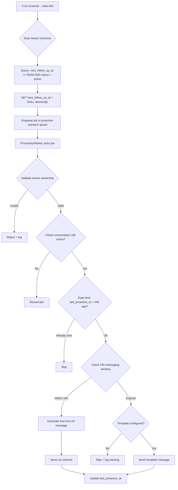

# Fase 2 — Background Triggers y Proactividad IA

> **Feature:** `proactive-outreach`
> **Spec:** `.kiro/specs/proactive-outreach/`
> **Estado:** Requirements completos, pendiente design + tasks

---

## 1. Resumen Ejecutivo

Sistema de outreach proactivo que permite a la IA enviar mensajes de seguimiento a clientes de forma autónoma, respetando la ventana de 24h de Meta API y manteniendo aislamiento estricto entre tenants.

**Flujo principal:**
```
Cron (60s) → Scan all tenant schemas → Enqueue BullMQ jobs → Worker processes → AI generates message → Send via channel
```

---

## 2. Modelo de Datos

### 2.1 Migración: `conversations` table

```sql
-- Añadir columna para programar follow-ups
ALTER TABLE "{{schema}}".conversations
  ADD COLUMN IF NOT EXISTS next_follow_up_at TIMESTAMPTZ DEFAULT NULL;

-- Índice parcial para escaneo eficiente de follow-ups pendientes
CREATE INDEX IF NOT EXISTS idx_conversations_follow_up
  ON "{{schema}}".conversations(next_follow_up_at)
  WHERE next_follow_up_at IS NOT NULL;
```

### 2.2 Registro de mensajes proactivos (rate limiting)

```sql
ALTER TABLE "{{schema}}".conversations
  ADD COLUMN IF NOT EXISTS last_proactive_at TIMESTAMPTZ DEFAULT NULL;
```

---

## 3. Arquitectura BullMQ

### 3.1 Queue: `proactive-outreach`

```typescript
// Configuración del queue
{
  name: 'proactive-outreach',
  defaultJobOptions: {
    attempts: 3,
    backoff: { type: 'exponential', delay: 30_000 },
    removeOnComplete: 100,
    removeOnFail: 500,
  },
}
```

### 3.2 Job Payload

```typescript
interface ProactiveOutreachJob {
  tenantId: string;
  schemaName: string;
  conversationId: string;
  customerId: string;
  channelType: 'whatsapp' | 'messenger' | 'instagram';
  scheduledAt: string; // ISO timestamp
}
```

### 3.3 Flujo de Procesamiento



---

## 4. Componentes NestJS

### 4.1 ProactivityCronService (nuevo)

```typescript
@Injectable()
export class ProactivityCronService {
  @Cron(CronExpression.EVERY_MINUTE)
  async scanDueFollowUps(): Promise<void> {
    // 1. Get all active tenants from public schema
    // 2. For each tenant, query due conversations
    // 3. Atomically null-out next_follow_up_at
    // 4. Enqueue jobs in BullMQ
  }
}
```

### 4.2 ProactivityWorker (nuevo)

```typescript
@Processor('proactive-outreach')
export class ProactivityWorker {
  @Process()
  async handleJob(job: Job<ProactiveOutreachJob>): Promise<void> {
    // 1. Validate tenant ownership
    // 2. Check conversation still active
    // 3. Check rate limit (1 per 24h)
    // 4. Check 24h messaging window
    // 5. Load context (history + customer memory)
    // 6. Generate proactive message via AiEngineService
    // 7. Send via messaging channel
    // 8. Update last_proactive_at
  }
}
```

### 4.3 schedule_follow_up Tool (AI)

```json
{
  "name": "schedule_follow_up",
  "description": "Programa un mensaje de seguimiento proactivo para esta conversación.",
  "parameters": {
    "type": "object",
    "properties": {
      "delay_hours": {
        "type": "number",
        "description": "Horas en el futuro para el follow-up (1-168)"
      },
      "reason": {
        "type": "string",
        "description": "Razón del follow-up (para contexto al generar el mensaje)"
      }
    },
    "required": ["delay_hours", "reason"]
  }
}
```

### 4.4 AiEngineService.triggerProactiveOutreach()

```typescript
async triggerProactiveOutreach(
  tenant: any,
  conversation: ConversationContext,
  schemaName: string,
): Promise<string> {
  // 1. Load conversation history
  // 2. Load customer memory context (profile + episodes)
  // 3. Build proactive system prompt
  // 4. Call GPT-4o with proactive instructions
  // 5. Return generated message text
}
```

---

## 5. Ventana 24h de Meta API

| Condición | Acción |
|-----------|--------|
| `last_message_at` + 24h > NOW() | Enviar mensaje libre (free-form) |
| `last_message_at` + 24h ≤ NOW() | Enviar template pre-aprobado |
| No hay template configurado | Skip + log warning |
| `last_message_at` es NULL | Skip + log warning |

### Templates requeridos por tenant

Cada tenant debe configurar al menos un template en `ai_config`:
```sql
ALTER TABLE "{{schema}}".ai_config
  ADD COLUMN IF NOT EXISTS proactive_template JSONB DEFAULT NULL;
-- Ejemplo: {"name": "follow_up_v1", "language": "es", "components": [...]}
```

---

## 6. Aislamiento de Tenant

### 6.1 Garantías

- Cada job BullMQ lleva `tenantId` + `schemaName` en el payload
- Worker valida que `schemaName` pertenece a `tenantId` antes de cualquier query
- Cron scanner itera tenants del registro público, nunca mezcla schemas
- Queries ejecutan exclusivamente dentro del schema del job

### 6.2 Tests de Aislamiento

```
✓ Job de tenant A procesado por worker no puede leer conversations de tenant B
✓ Cron scanner falla en tenant A no bloquea scan de tenant B
✓ Rate limit de tenant A no afecta rate limit de tenant B
✓ Template de tenant A no se usa para mensajes de tenant B
✓ Job con tenantId/schemaName mismatch es rechazado
```

---

## 7. Rate Limiting

| Regla | Valor |
|-------|-------|
| Max proactive messages per conversation | 1 / 24h |
| Max proactive messages per tenant per minute | 10 |
| Job max age (TTL) | 1 hora |
| Retry attempts | 3 (exponential backoff: 30s, 60s, 120s) |

---

## 8. Dashboard API

| Método | Endpoint | Descripción |
|--------|----------|-------------|
| GET | `/conversations/follow-ups` | Lista follow-ups pendientes del tenant |
| DELETE | `/conversations/:id/follow-up` | Cancelar follow-up programado |

---

## 9. Dependencias

| Componente | Paquete | Notas |
|------------|---------|-------|
| BullMQ Queue | `@nestjs/bull` + `bull` | Ya instalado |
| Cron | `@nestjs/schedule` | Necesita instalarse |
| Redis | `ioredis` | Ya configurado (6380) |
| Worker | `apps/worker/` | Nuevo servicio (actualmente disabled en docker-compose) |

---

## 10. Plan de Implementación

1. Schema migration (add columns + index)
2. ProactivityModule con CronService + Worker
3. `schedule_follow_up` tool en AiEngineService
4. `triggerProactiveOutreach()` en AiEngineService
5. Dashboard endpoints
6. Tenant isolation tests
7. apps/worker Dockerfile + docker-compose integration
