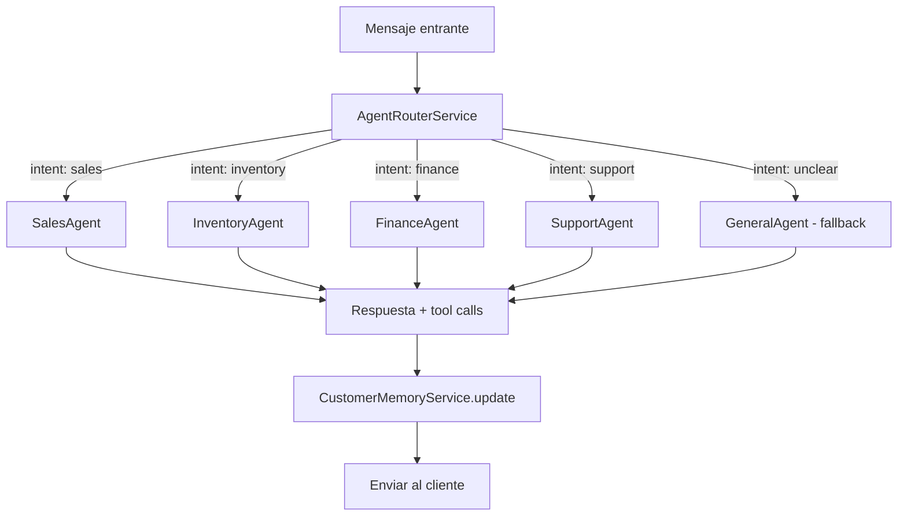

# Fase 3 — Arquitectura de Multi-Agentes Especializados (Agentic Loops)

> **Estado:** Documento de visión / diseño conceptual
> **Prerequisitos:** Fase 2 completada (customer-memory + proactividad BullMQ)
> **Impacto:** Refactorización del core `AiEngineService`

---

## 1. Problema

El `AiEngineService` actual usa un único system prompt masivo que intenta resolver ventas, soporte, logística y conciliación en una sola llamada a GPT-4o. Esto genera:

- **Prompt bloat** — El contexto crece con cada tool agregado, degradando la calidad de respuestas
- **Conflicto de personalidad** — Un agente de ventas agresivo no debería tener el mismo tono que uno de soporte
- **Latencia** — Más tools = más tokens de entrada = más costo y tiempo
- **Dificultad de evolución** — Agregar capacidades nuevas requiere modificar un archivo monolítico

---

## 2. Solución: Enrutamiento a Agentes Especializados

```
                    ┌─────────────────────────────────┐
                    │       AgentRouterService         │
                    │  (Clasificador de intención)     │
                    └──────────┬──────────────────────┘
                               │
              ┌────────────────┼────────────────┐
              │                │                │
    ┌─────────▼──────┐ ┌──────▼───────┐ ┌──────▼──────────┐
    │  SalesAgent    │ │ InventoryAgent│ │ FinanceAgent    │
    │                │ │              │ │                 │
    │ • Cierre venta │ │ • Stock check│ │ • Conciliación  │
    │ • Objeciones   │ │ • Resurtido  │ │ • Discrepancias │
    │ • Upsell       │ │ • Alertas    │ │ • Pagos         │
    │ • Descuentos   │ │ • Proveedores│ │ • Stripe/Bank   │
    └────────────────┘ └──────────────┘ └─────────────────┘
```

### 2.1 Flujo de Enrutamiento



---

## 3. Agentes Definidos

### 3A. Agente de Ventas & Conversión

| Aspecto | Detalle |
|---------|---------|
| **Trigger** | Mensaje con intención de compra, consulta de precio, objeción |
| **System Prompt** | Optimizado para cierre: urgencia, beneficios, manejo de objeciones |
| **Tools exclusivos** | `create_order`, `apply_discount`, `check_product_availability`, `suggest_upsell` |
| **Políticas** | Lee `ai_config.commercial_policies` (JSONB) para descuentos máximos, promociones activas |
| **Tono** | Persuasivo pero respetuoso, adaptado al tenant |
| **Proactividad** | Si el cliente duda → `schedule_follow_up(4h, "cliente indeciso")` |

**Ejemplo de loop autónomo:**
```
Cliente: "Está muy caro el vestido"
→ SalesAgent detecta objeción de precio
→ Consulta políticas: descuento máximo 15% para primera compra
→ Ofrece: "Te puedo hacer un 10% por ser tu primera compra, ¿te interesa?"
→ Si acepta → create_order + apply_discount
→ Si no responde en 4h → schedule_follow_up con contexto de objeción
```

### 3B. Agente de Inventario y Compras

| Aspecto | Detalle |
|---------|---------|
| **Trigger** | Cron autónomo (no requiere mensaje del cliente) |
| **Frecuencia** | Cada 6 horas escanea `inventory.stock_available < stock_minimum` |
| **Acción** | Genera borrador de email para proveedor con items a resurtir |
| **Tools exclusivos** | `check_all_stock_levels`, `draft_supplier_email`, `create_purchase_order` |
| **Output** | Email draft en `notifications` queue + alerta en dashboard |
| **Datos** | Lee `products.supplier_info` (JSONB nuevo) para contacto del proveedor |

**Ejemplo de loop autónomo:**
```
Cron 6h → InventoryAgent.scanLowStock(schemaName)
→ Detecta: "Vestido Mariposas" stock=2, minimum=5
→ Lee supplier_info: "Proveedor Textiles MX, compras@textilesmx.com"
→ Genera email: "Solicitud de resurtido: 20 unidades Vestido Mariposas (SKU VK-VEST-001)"
→ Encola en notifications queue para revisión del admin
→ Crea alerta en dashboard: "⚠️ 3 productos bajo stock mínimo"
```

### 3C. Agente de Conciliación Financiera

| Aspecto | Detalle |
|---------|---------|
| **Trigger** | Webhook de Stripe/banco + Cron diario de reconciliación |
| **Función** | Cruza `payments` (verificados por OCR/visión) contra movimientos bancarios reales |
| **Tools exclusivos** | `match_payment_to_transaction`, `flag_discrepancy`, `auto_reconcile_cents` |
| **Tolerancia** | Auto-resuelve discrepancias ≤ $5 MXN (configurable por tenant) |
| **Escalación** | Discrepancias > tolerancia → alerta al admin con detalle |
| **Integraciones** | Stripe webhooks (ya existe), Open Banking APIs (futuro) |

**Ejemplo de loop autónomo:**
```
Stripe webhook: charge.succeeded $299.00 (ref: ORD-2026-00042)
→ FinanceAgent busca payment con order ORD-2026-00042
→ Encuentra: payment verificado por OCR = $299.50 (discrepancia $0.50)
→ Tolerancia = $5 → auto_reconcile_cents()
→ Marca payment como "reconciled" con nota: "Ajuste automático -$0.50"
→ Si discrepancia fuera $15 → flag_discrepancy() → alerta admin
```

---

## 4. Arquitectura Técnica

### 4.1 Nuevo: `AgentRouterService`

```typescript
@Injectable()
export class AgentRouterService {
  /**
   * Clasifica la intención del mensaje y enruta al agente apropiado.
   * Usa un LLM ligero (gpt-4o-mini) para clasificación rápida.
   */
  async route(
    message: string,
    conversationContext: any,
    schemaName: string,
  ): Promise<AgentType> {
    // 1. Heurísticas rápidas (keywords, estado del pedido)
    // 2. Si ambiguo → clasificación LLM (gpt-4o-mini, ~50ms)
    // 3. Retorna: 'sales' | 'inventory' | 'finance' | 'support' | 'general'
  }
}
```

### 4.2 Interfaz base: `BaseAgent`

```typescript
abstract class BaseAgent {
  abstract readonly name: string;
  abstract readonly systemPrompt: string;
  abstract readonly tools: OpenAI.Chat.ChatCompletionTool[];
  
  /** Procesa un mensaje con el contexto del agente especializado */
  abstract process(
    message: string,
    context: AgentContext,
    schemaName: string,
  ): Promise<AgentResponse>;
}
```

### 4.3 Registro de agentes por tenant

```sql
-- Nuevo en ai_config
ALTER TABLE "{{schema}}".ai_config
  ADD COLUMN IF NOT EXISTS agent_config JSONB DEFAULT '{
    "router_model": "gpt-4o-mini",
    "agents": {
      "sales": { "enabled": true, "model": "gpt-4o", "temperature": 0.4 },
      "inventory": { "enabled": true, "model": "gpt-4o-mini", "cron": "0 */6 * * *" },
      "finance": { "enabled": false, "model": "gpt-4o-mini" },
      "support": { "enabled": true, "model": "gpt-4o", "temperature": 0.2 }
    },
    "commercial_policies": {
      "max_discount_percent": 15,
      "first_purchase_discount": 10,
      "active_promotions": []
    }
  }';
```

### 4.4 Migración desde `AiEngineService` actual

| Actual | Futuro |
|--------|--------|
| `AiEngineService.processMessage()` | `AgentRouterService.route()` → `agent.process()` |
| `AiEngineService.getTools()` (monolítico) | Cada agente define sus propios tools |
| `AiEngineService.buildSystemPrompt()` | Cada agente tiene su propio prompt optimizado |
| `AiEngineService.executeTool()` (switch gigante) | Cada agente ejecuta solo sus tools |

**Compatibilidad:** El `AiEngineService` actual se convierte en el `GeneralAgent` (fallback) sin romper nada existente.

---

## 5. Modelo de Costos

| Agente | Modelo | Tokens/msg (est.) | Costo/msg |
|--------|--------|-------------------|-----------|
| Router | gpt-4o-mini | ~200 | $0.0001 |
| Sales | gpt-4o | ~1500 | $0.008 |
| Inventory | gpt-4o-mini | ~800 | $0.0004 |
| Finance | gpt-4o-mini | ~600 | $0.0003 |
| Support | gpt-4o | ~1200 | $0.006 |

**Ahorro vs monolítico:** El router + agente especializado usa ~30% menos tokens que el prompt monolítico actual porque cada agente solo carga sus tools y contexto relevante.

---

## 6. Prioridad de Implementación

| Fase | Agente | Complejidad | Valor de negocio |
|------|--------|-------------|-----------------|
| 3.1 | AgentRouter + SalesAgent | Media | 🔥🔥🔥 Alto (cierre de ventas) |
| 3.2 | InventoryAgent (cron autónomo) | Baja | 🔥🔥 Medio (prevención desabasto) |
| 3.3 | FinanceAgent (reconciliación) | Alta | 🔥🔥🔥 Alto (reduce errores financieros) |
| 3.4 | SupportAgent (separado) | Baja | 🔥 Medio (mejor tono) |

---

## 7. Dependencias

| Componente | Estado | Notas |
|------------|--------|-------|
| CustomerMemoryService | ✅ Implementado | Todos los agentes lo usan para contexto |
| ProactivityCronService | ✅ Implementado | InventoryAgent y FinanceAgent lo extienden |
| BullMQ queues | ✅ Configurado | Nuevas queues: `inventory-alerts`, `finance-reconciliation` |
| Stripe webhooks | ✅ Existe endpoint | FinanceAgent se suscribe a eventos |
| Open Banking API | ❌ Futuro | Fase 3.3+ |
| `supplier_info` en products | ❌ Nuevo campo | Fase 3.2 |
| `commercial_policies` en ai_config | ❌ Nuevo campo | Fase 3.1 |

---

## 8. Riesgos y Mitigaciones

| Riesgo | Impacto | Mitigación |
|--------|---------|------------|
| Router clasifica mal → agente incorrecto | Respuesta irrelevante | Fallback a GeneralAgent si confianza < 0.7 |
| Agente de ventas demasiado agresivo | Mala experiencia | Políticas comerciales como guardrails + tono configurable |
| InventoryAgent envía emails sin revisión | Pedidos erróneos a proveedores | Draft mode: admin aprueba antes de enviar |
| FinanceAgent auto-reconcilia incorrectamente | Pérdida financiera | Tolerancia configurable + log auditable + alerta si > umbral |
| Latencia adicional del router | +100ms por mensaje | Router usa gpt-4o-mini (50ms) + cache de intención por conversación |

---

## 9. Decisión Pendiente

Antes de implementar, definir:

1. **¿Router LLM o heurístico?** — Un router basado en keywords + estado del pedido es más rápido y predecible. LLM solo para casos ambiguos.
2. **¿Agentes como módulos NestJS separados o como clases dentro del AiModule?** — Módulos separados dan mejor aislamiento pero más complejidad de DI.
3. **¿InventoryAgent envía emails directamente o solo genera drafts?** — Draft mode es más seguro para MVP.
4. **¿FinanceAgent requiere Open Banking desde el inicio o solo Stripe?** — Solo Stripe para MVP, Open Banking en fase posterior.
